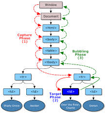

# Javascript Events

Events are _fired_ or _triggered_ in response to some action in the browser. Typical events are.  

* Click Events  
* Page Load Events
* Form Events
* Mouse Over Events.

## [DOM Events](http://en.wikipedia.org/wiki/DOM_events)
Take a  look at these [Events](http://en.wikipedia.org/wiki/DOM_events#Common.2FW3C_events).

### Events can have.
* Type  
	What kind of event it is. For example, mousemove, keydown, click, doubleclick are all event types.

* Target  
	Object where the event happened. For example, an element, a window can be event targets.
	
* Handler  
	Function that gets invoked when an Event is fired.
	
	
	
Each Event has an event object that has a set of properties associated with it. These properties. This object is created when the Event is fired. Some properties are the event type and target.

### DOM Simple Event Lab.

## Event propagation.
How the events travel through the DOM. 

1. The capture phase: The event object must propagate through the target's ancestors from the defaultView to the target's parent. This phase is also known as the capturing phase. Event listeners registered for this phase must handle the event before it reaches its target.

2. The target phase: The event object must arrive at the event object's event target. This phase is also known as the at-target phase. Event listeners registered for this phase must handle the event once it has reached its target. If the event type indicates that the event must not bubble, the event object must halt after completion of this phase.

3. The bubble phase: The event object propagates through the target's ancestors in reverse order, starting with the target's parent and ending with the defaultView. This phase is also known as the bubbling phase. Event listeners registered for this phase must handle the event after it has reached its target.

[W3C Event Flow](http://www.w3.org/TR/DOM-Level-2-Events/events.html#Events-flow)

### Event Capturing.
The first phasee of propagation is __capturing__. Each ancestor of the element that is the target of the event __may__ intercept the event and either ignore the event of do some processing.

### Event Bubbling.
The last phase of propagation is __bubbling__. The event can __bubble__ up the DOM tree. Each ancestor of the element generating the event will recieve the event after the target element This event is __bubbling up__ the DOM tree.

### DOM Event Propagation Lab
1. Write an app that dynamically adds list elements to a list with an input field.  The list elements should be able to delete themselves.
2. Attach the list element delete handler function to the list container.

## This pointer in Events

